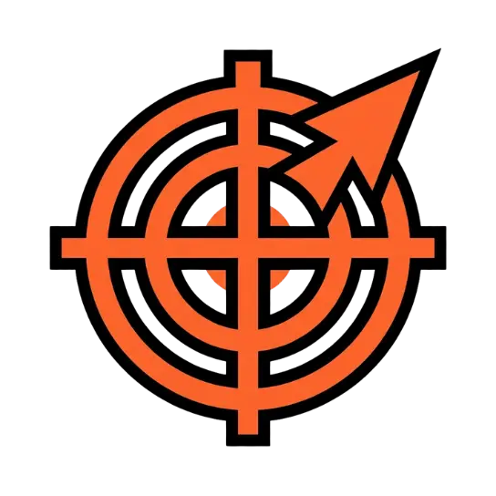
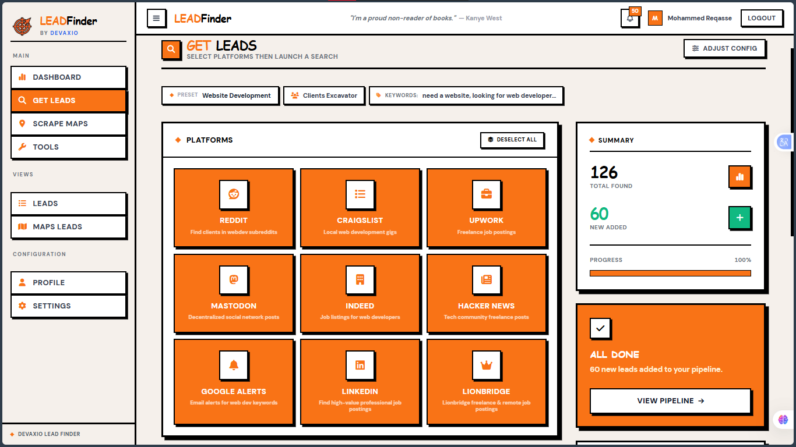
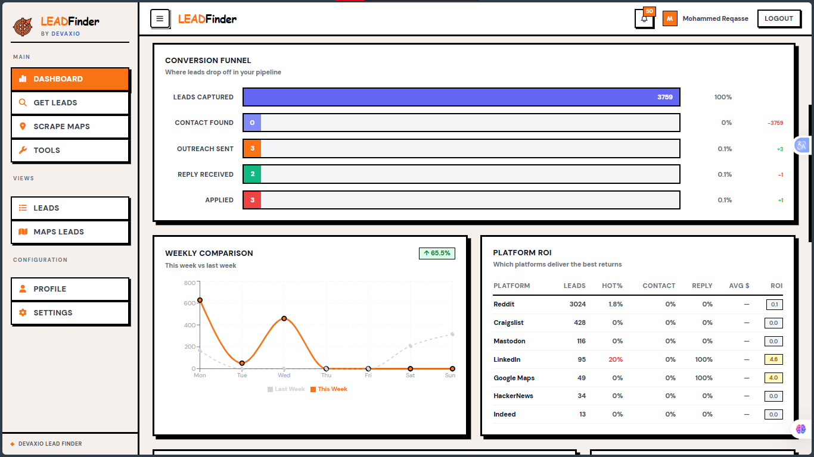
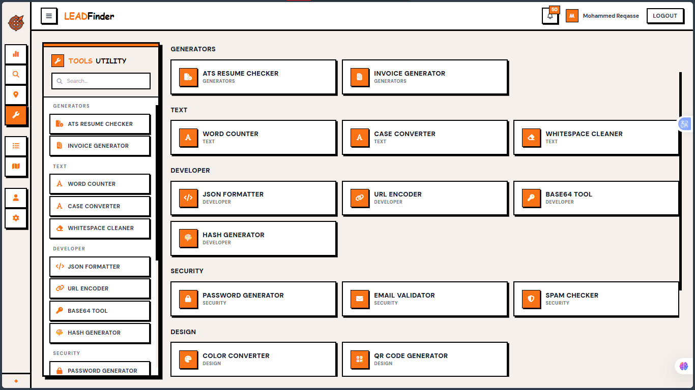
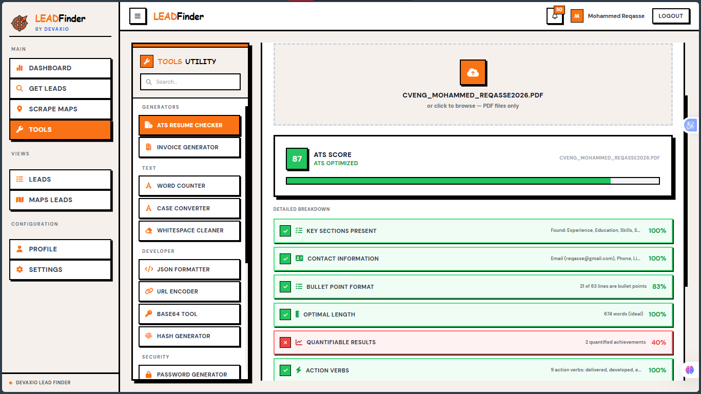
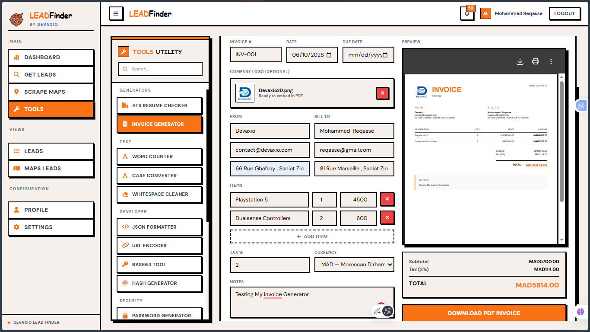

<p align="center">
  <br/>
  
  <br/>
  <br/>
  <strong style="font-size: 3.5em; font-family: 'Impact', 'Arial Black', sans-serif; letter-spacing: 0.02em;">
    <span style="color: #FF6B35;">LEAD</span>Finder
  </strong>
  <br/>
  <span style="font-size: 1em; font-weight: 700; color: #555; letter-spacing: 0.15em; text-transform: uppercase;">
    By <a href="https://devaxio.com" style="color: #2563eb;">Devaxio</a>
  </span>
  <br/>
  <br/>
  <span style="font-size: 1.1em; font-weight: 600; color: #333;">
    AI-powered lead discovery engine — scrapes, ranks, and drafts replies across<br/>
    <strong style="color: #FF6B35;">8+ platforms</strong> so you never miss a client.
  </span>
  <br/>
  <br/>

  <!-- Tech badges -->
  
  
  
  
  
  
</p>

<br/>

---

> **LEADFinder** is a full-stack localhost application that turns the chaos of
> 8 different platforms into one clean, brutalist dashboard. It scrapes
> Reddit, Craigslist, Upwork, Google Alerts, Mastodon, Indeed, and
> Hacker News — then uses AI to rank leads by budget/urgency and draft
> personalized replies from your uploaded resume.
>
> *Zero monthly cost. Runs on your machine. Scales with your team.*

<br/>

---

<br/>

<p align="center">
  <a href="#rocket-quick-start">
    <kbd>
      
    </kbd>
  </a>
  <br/>
  <em style="font-size: 0.85em; font-weight: 700; color: #777; text-transform: uppercase;">/// live pipeline — jobs streaming in from 8 platforms, ranked by AI ///</em>
</p>

<br/>

---

<br/>

## :rocket: Quick Start

### Python (Windows — first time)

```powershell
# 1. Download Python from https://www.python.org/downloads/ (check "Add Python to PATH")
# 2. Verify it's installed:
python --version
# 3. Upgrade pip (optional but recommended):
python -m pip install --upgrade pip
```

### Python (Linux — first time)

```bash
# Debian / Ubuntu / Mint:
sudo apt update && sudo apt install python3 python3-pip python3-venv -y

# Fedora:
sudo dnf install python3 python3-pip -y

# Arch:
sudo pacman -S python python-pip --noconfirm

# Verify:
python3 --version && pip3 --version
```

### Project Setup

```bash
# 1. Install backend dependencies
pip install -r requirements.txt

# 2. Install frontend dependencies
cd frontend && npm install && cd ..

# 3. Launch both servers
python run.py
```

Then open **[http://localhost:5173](http://localhost:5173)** — the backend API docs
live at **[http://localhost:8000/docs](http://localhost:8000/docs)**.

> [!TIP]
> **First run?** Create an account, upload your resume (AI auto-parses it),
> then head to **Settings → Presets** to pick a search configuration.
> Full workflow in the [Launch Guide](#first-launch).

<br/>

---

<br/>

## :wrench: Tech Stack

<p align="center">
  <!-- Language badges -->
  <a href="#">
    
    
    
    
  </a>
</p>

| Layer | Technologies |
|-------|-------------|
| **Backend** |     |
| **AI / LLM** |     |
| **Frontend** |     |
| **Scraping** |     |
| **Infra** |    |

<br/>

---

<br/>

## :open_file_folder: Structure

```
LEADFinder/
├── backend/                    # FastAPI application
│   ├── ai/                     # AI clients + draft generator
│   │   ├── openrouter_client.py
│   │   ├── github_client.py
│   │   └── draft_generator.py
│   ├── routers/                # API endpoints
│   │   ├── auth.py             # Login / register / OAuth
│   │   ├── leads.py            # CRUD + ranking
│   │   ├── replies.py          # Drafts + send + retry
│   │   ├── settings.py         # Budgets / limits / keywords
│   │   └── ai_config.py        # Model provider config
│   ├── scrapers/               # Source-specific scrapers
│   │   ├── reddit.py
│   │   ├── craigslist.py
│   │   ├── upwork.py
│   │   ├── mastodon.py
│   │   ├── indeed.py
│   │   ├── hackernews.py
│   │   └── google_alerts.py
│   ├── utils/                  # Ranking, currency formatting
│   ├── main.py                 # FastAPI entry point
│   ├── database.py             # SQLAlchemy config
│   └── models.py               # DB schemas
│
├── frontend/                   # React application
│   ├── src/
│   │   ├── components/         # UI components
│   │   │   ├── Auth/
│   │   │   ├── Dashboard/
│   │   │   ├── Layout/         # Sidebar, Header
│   │   │   ├── Leads/
│   │   │   ├── Settings/       # Tabbed settings page
│   │   │   └── Profile/
│   │   ├── hooks/              # useAuth, useSettings, useLeads
│   │   └── services/
│   │       └── api.js          # Axios instance
│   ├── package.json
│   └── vite.config.js
│
├── assets/                     # Images, screenshots
├── requirements.txt            # Python dependencies
└── run.py                      # One-command launcher
```

<br/>

---

<br/>

## :dart: Features

<dl>
  <dt><strong>Multi-Platform Scraping</strong></dt>
  <dd>8 sources — Reddit, Craigslist, Upwork, Google Alerts, Mastodon, Indeed, Hacker News. Each runs on its own schedule with configurable rate limits.</dd>

  <dt><strong>AI-Powered Ranking</strong></dt>
  <dd>Leads are auto-ranked <em>Hot</em> / <em>Warm</em> / <em>Cold</em> based on budget keywords and urgency signals. Budgets converted to MAD for comparison.</dd>

  <dt><strong>Resume-Aware Drafting</strong></dt>
  <dd>Upload your resume once — AI parses your name, portfolio, pricing, skills, and tone. Every draft is personalized and on-brand.</dd>

  <dt><strong>Kanban &amp; List Views</strong></dt>
  <dd>Toggle between chronological list, Kanban board (New &rarr; Drafted &rarr; Replied &rarr; Archived), or split view for high-volume triage.</dd>

  <dt><strong>Configurable Everything</strong></dt>
  <dd>Budget ranges, rate limits, keyword boosts/blacklists, AI models, search presets — all editable from the Settings panel.</dd>

  <dt><strong>Multi-User Ready</strong></dt>
  <dd>1 admin + 2-3 team members. OAuth (Google/GitHub) or email/password auth. Local SQLite — no cloud costs.</dd>
</dl>

<br/>

---

<br/>

## :checkered_flag: First Launch

1. Open [localhost:5173](http://localhost:5173) and **create an admin account**
2. Go to **Profile** and upload your resume — AI parses it instantly
3. Go to **Settings &rarr; Presets** and pick a search preset (or create your own)
4. Configure **Connection Center** with your API keys (Reddit, Gmail, etc.)
5. Set **Budget & Limits** to match your workflow
6. Dashboard populates automatically as scrapers find leads

<br/>

---

<br/>

## :camera: Screenshots

| :zap: Full Dashboard | :hammer: 17+ Built-in Tools |
|----------------------|----------------------------|
| <kbd></kbd> | <kbd></kbd> |
| *Rank, filter, bulk-edit, and track every lead from one brutalist cockpit* | *Word counter, QR generator, JSON formatter, invoice generator & more — all free* |

| :page_facing_up: ATS Resume Checker | :receipt: Invoice Generator |
|-------------------------------------|-----------------------------|
| <kbd></kbd> | <kbd></kbd> |
| *Paste any job description — Our Algorithm scores your resume and highlights skill gaps* | *Create branded PDF invoices with one click, ready to send* |

<br/>

---

<br/>

<p align="center">
  <span style="font-size: 0.85em; font-weight: 700; color: #999; text-transform: uppercase; letter-spacing: 0.1em;">
    Built with <span style="color: #FF6B35;">&#9632;</span> by
    <a href="https://devaxio.com" style="color: #2563eb; font-weight: 900; text-decoration: none;">Devaxio</a>
  </span>
  <br/>
  <span style="font-size: 0.75em; color: #bbb;">
    LEADFinder &mdash; 2026 &mdash; Local-first &mdash; AI-native
  </span>
</p>
